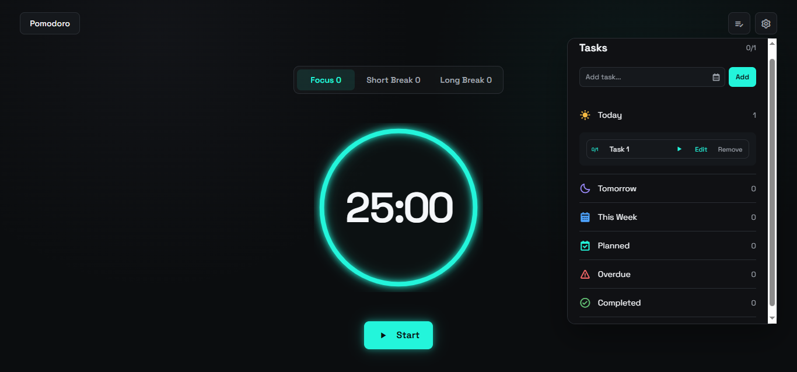

# Pomodoro App

A responsive Pomodoro productivity application built with HTML, CSS and vanilla JavaScript.

This project was built to strengthen my JavaScript fundamentals through a practical application with timer logic, task management, state management, browser storage and user settings.

## 🔗 Live Demo

[View Live Demo](https://mzwandilem.github.io/Pomodoro/)

## 📸 Screenshot



## ✨ Features

### Pomodoro Timer

- Focus timer
- Short break timer
- Long break timer
- Start and pause timer
- Resume paused sessions
- Reset active timer
- Visual circular timer progress
- Automatic session tracking
- Configurable timer durations

### Task Management

- Create tasks with a title and due date
- Edit existing tasks
- Delete tasks
- Set required Pomodoro sessions per task
- Track completed Pomodoro sessions
- Mark tasks as completed automatically
- Track task completion progress
- Organize tasks by date
- Today, Tomorrow, This Week and Planned sections
- Overdue task section
- Completed task section
- Empty task states
- Expand and collapse task sections

### Automatic Sessions

- Automatically start focus sessions
- Automatically start short breaks
- Automatically start long breaks
- Configure how many focus sessions occur before a long break

### Alarms

- Enable or disable session alarms
- Multiple alarm sounds
- Audio notification when a session ends

### Settings

- Customize focus duration
- Customize short break duration
- Customize long break duration
- Configure automatic session starting
- Configure long break frequency
- Enable or disable alarms
- Select alarm sounds
- Switch between dark and light mode
- Reset settings to default values

### Data Persistence

- Tasks are stored in `localStorage`
- Pomodoro settings are stored in `localStorage`
- Session counts are stored in `localStorage`
- Data remains available after refreshing the browser

### UI

- Responsive layout
- Dark and light themes
- Circular timer progress indicator
- Task progress indicators
- Collapsible task sections
- Modal interfaces
- Contextual action buttons
- Empty states
- Completed task styling
- Responsive mobile layout

## 🛠️ Technologies

- HTML5
- CSS3
- JavaScript
- LocalStorage API
- Web Audio API
- Browser Crypto API
- Boxicons
- Google Fonts

## 🧠 JavaScript Concepts Practiced

This project helped me practice:

- DOM manipulation
- Event listeners
- Arrays and objects
- `map`, `filter` and `find`
- Functions
- Conditional rendering
- Template literals
- CRUD operations
- LocalStorage
- JSON serialization
- UUID generation
- Date handling
- Form handling
- State management
- Dynamic HTML rendering
- Input validation
- Timers and intervals
- Timer state management
- Modal management
- Audio API
- Theme management
- Managing application settings
- Persistent application state

## 📁 Project Structure

```text
pomodoro-app/
│
├── index.html
├── style.css
├── script.js
├── screenshot.PNG
└── README.md
